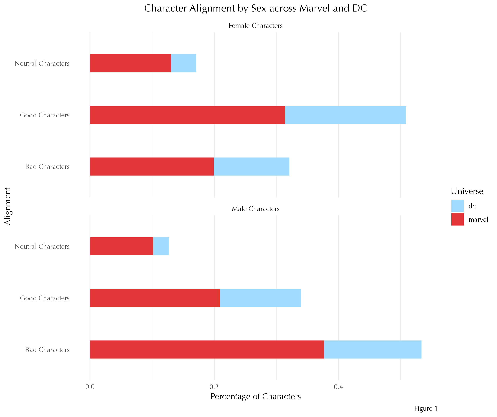
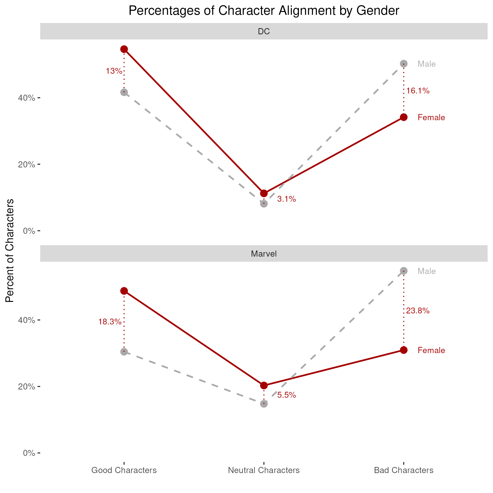
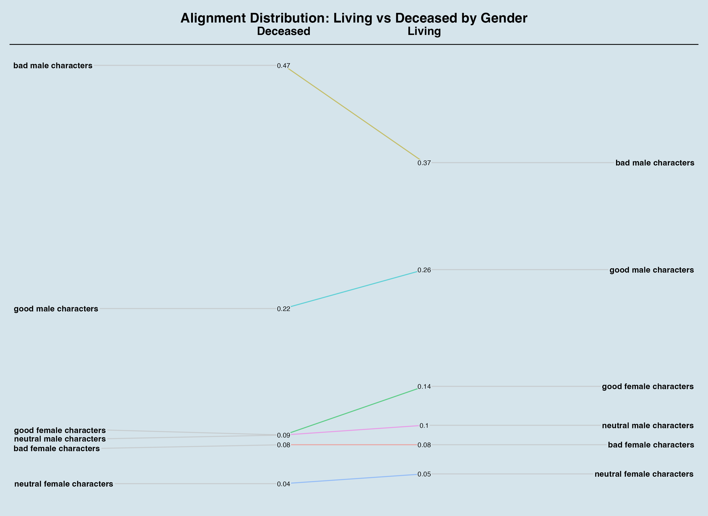

# Heroines and Villains: A Look into Gender and Morality in Comics
*Kat Fan*

The famous 1999 blog post by Simone Gail posits the phenomenon of “Women in Refrigerators,” where heroines become disproportionately depowered, harmed, killed, then sometimes revived, in superhero stories1. The term draws attention to the way women are often written as dispensable or manipulatable tropes to advance the storylines of their often male counterparts, instead of being developed as autonomous, 3-dimentional agents themselves.

In the mainstream comics world, gender issues persist within and beyond the ways characters are portrayed on the page. There are countless additional gendered tropes in comics: the damsel in distress, who is powerless herself and in need of saving; the femme fatale, a beautiful and mysterious woman who weaponizes her sexuality against men; “good girl art,” a style of hyper-sexualized, feminine-presenting women that gained considerable popularity among young men in the 1940s; conversely, there is also “bad girl art,” consisting of powerful, beautiful superheroines who are often morally ambiguous. The presentation of morality is often distinct across genders - and similarly, the interaction between gender and moral alignment differ between men and women characters. Goodness may be rewarded for some while evilness may be punished for others.

How exactly does the gender disparity present itself in mainstream comic books? How is morality represented across genders? Using data across both Marvel and DC universes, across almost 7 decades, we will have a glimpse into these questions.

## Women in refrigerators…then revived?

In the superhero comic book world, there has been a long-standing contrast in gender distribution and representation. The genre, from creators to audiences to characters, has been male dominated. A 2023 article reports that approximately 26.7% of all characters in Marvel and DC’s comic universes are women - a number that has not seen significant change over the decades of American mainstream comics since the 1930s.2 But are women truly disproportionately deceased in comic books than men like Gail has observed? Interestingly, a look into the total recorded characters in Marvel and DC comics from 1937 to 2013 says no.

*Figure 1: The number of female characters per male character ratio in living characters is consistently above the overall ratio (~0.35 female character per 1 male character) and consistently higher than the ratio in deceased characters across characters of all numbers of appearances.*

Figure 1 shows an unsurprisingly low average ratio of the number of female characters per male character at around 0.35, meaning that for every one female character in DC and Marvel comics, we observe almost 3 male characters. This ratio changes significantly between living and deceased characters. Notably, for frequently-appearing characters with over 200 recorded appearances, the female to male ratio is ½ in living characters, in contrast to the ⅕ ratio in deceased characters. In short: there are, proportionally speaking, a lot more living female characters and a lot more deceased male characters.

## Heroines and villains: a gendered dynamic

How is “goodness” and “evilness” represented in women in comics? The trend is similar in Marvel and DC universes: Figure 2 below reveals that women are much more likely to be good while men are much more likely to be bad, with percentage differences as high as 23.8%.

*Figure 2: More female characters tend to be “good” while more male characters tend to be “bad,” across the Marvel and DC universes*

Interestingly, while male characters are much more likely to be deceased if they are aligned as villains, bad female characters do not see the same fate. Good characters, men and women, see a higher percentage to be living than deceased (Figure 3).

*Figure 3: More bad male characters are deceased than living, while bad female characters are equally likely to be alive or deceased; goodness sees a higher percentage in living characters over deceased characters for both genders.*

## What we know now

The data reveals that while there is visible gender imbalance in the number of characters, the relationship between gender, violence, harm, and death is not fully captured in the living and deceased character numbers: the data does not consider whether a character was revived, depowered, or otherwise harmed; the alive status is current as of 2013. The manner of death is also unrecorded - women may well still be frequently “fridged” in comic books as opposed to, for example, sacrificing themselves in a heroic fight against Doomsday like Superman in the 1992 issue of The Death of Superman.

What we can observe is the distinct fate men and women characters meet based on their moral alignment - though "goodness" is rewarded with higher chance of living in both genders, being "bad" or a villain often results in deaths for male characters, while evilness in female characters does not meet the same punishment.

“Women in Refrigerators” is not a standalone phenomenon. In Alan Moore’s Watchmen, Silk Spectre Laurie takes on the role of a parody for her heroine peers: in her costumes designed to accommodate aesthetics over combat, she finds that her job as a superhero consists more of photoshoots and optics over crime-fighting. Her experience with how her image and sexuality is consumed by the public and her relationship with morality, violence, and agency are metafictional reflections of the women characters in comics - a topic that should continues to be explored, discussed, and changed.

## Citations
1. *Women In Refrigerators*. LBY3. Retrieved May 9, 2025, from https://lby3.com/wir/index.html
2. Warsi, S. (2023). *Women in Comic Books*. Kaggle. Retrieved May 9, 2025, from https://www.kaggle.com/datasets/shamirwarsi/women-in-comic-books  
3. Joissim, J. (2023, March 30). *Women In Superhero Media: “Sheroes” Done Wrong*. The Boulevard Online. Retrieved from https://theboulevard252.org/6029/features/women-in-superhero-media-sheros-done-wrong/

*Source Data: [Women in Comic Books](https://www.kaggle.com/datasets/shamirwarsi/women-in-comic-books)*
