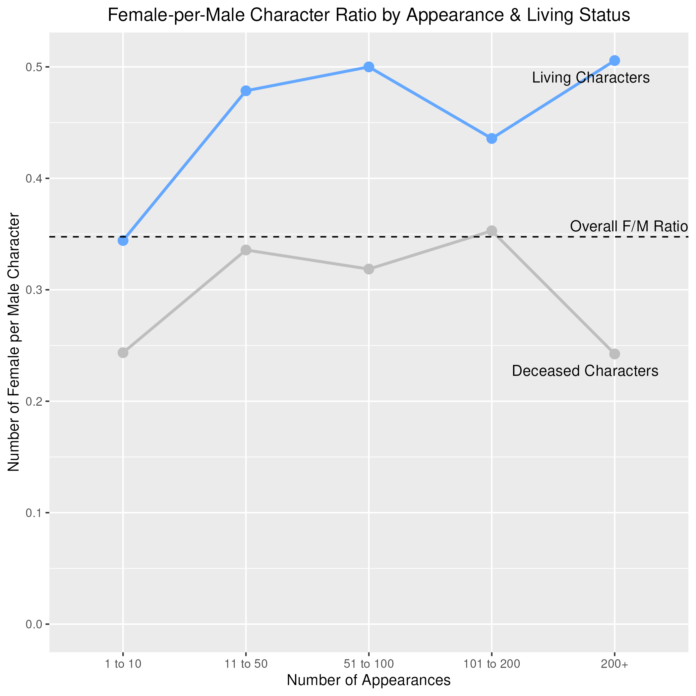
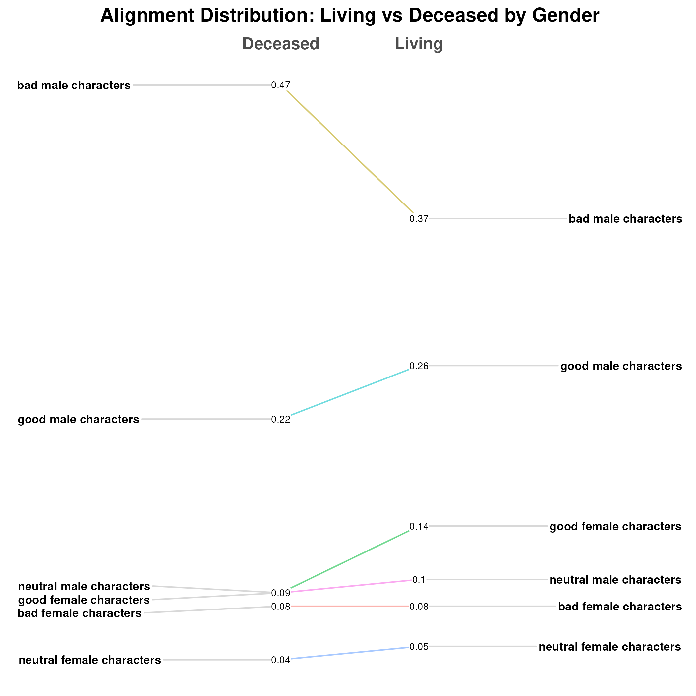

## Gender Ratio by Appearance & Living Status

The term "women in refrigerators" is a literary trope coined by Gail Simone to describe the phenomenon of female characters disproportionally facing harm or death to advance storylines in fictional works. This trope is especially well-observed in comic books. This figure looks at the ratio of female to male characters across numbers of appearances (a lower number corresponds to less appearances and a higher number corresponds to a more prominent character presence) and living status to investigate this phenomenon across the Marvel and DC comic universes.

The following figures only include sex by male/female due to minimal data on transgender, agender, and gender nonconforming characters. 

  
*Gender ratio by appearance and living status. Overall gender ration ~ 0.35*

The dashed line represents the overall gender ratio (female to male) in Marvel and DC comics from 1935-2013 at around 0.35. We can see that, surprisingly, the gender ratio is higher than the overall value between living characters, suggesting that there are more female proportional to male characters among those who are living instead of deceased.

However, this does not take into account the manner of which characters die; whether they have faced certain types of harm; whether they have been revived, etc.

## Character Alignment by Sex 

Another question we want to ask is whether the representation moral alignment differ across characters of different genders. The next figure shoes the percentage of characters by moral alignment (good, bad, or neutral) for male and female characters, with indicators for the universe represented.

  
*Character Alignment by Sex across Marvel and DC: good characters take up the largest percentage of female characters, while bad characters take up the largest percentage of male characters.*

In the figure above, we can see that good characters take up the largest percentage of female characters, while bad characters take up the largest percentage of male characters. The percentage of neutral characters is similar across genders. The difference is significant here - over half of the female characters are "good", while only around 35 percent of male characters are "good."

## Character distribution by gender and alignment

The last figure investigates whether there is a difference in proportions between characters of different gender and moral alignments between deceased and living statuses.

*Character distribution by gender and moral alignment: female characters of good moral alignments take up the lowest proportion of deceased characters, while male characters of bad moral alignment take up the largest proportion of deceased characters.*

There are several questions to be asked regarding this figure: why do "good" female characters disproportionally survive and why do "bad" male characters disproportionally die? Is goodness more rewarded in female characters and evilness more punished in male characters?

1. The first figure uses bar plots to highlight the juxtaposition between the percentages of characters by moral alignments between genders, drawing readers' attention to the significant difference in shapes between the two groups' percentage values (shape channel!).
2. The second figure makes use of color to quickly communicate the difference in gender ratio between living and deceased characters by assigning distinct color values to "living" and "deceased" statuses.
3. The second figure decreases the amount of data readers have to process to facilitate clearer communication of patterns. This is done using bins - by binning character counts by ranges of numbers of appearances, readers have to process a lot less information and clearly observe the consistent difference in gender ratio between alive/deceased statuses across character prominence. 
4. Figure 3 utilizes shape to effectively show the difference in ratio to the audiences. The pie charts are a great shape in communicating the difference in percentages between groups.
5. Figure 3 also utilizes color to make comparisons between the same groups across charts visible. For example, "good female characters" are represented by the same color across all three charts, allowing the reader to easily compare them.